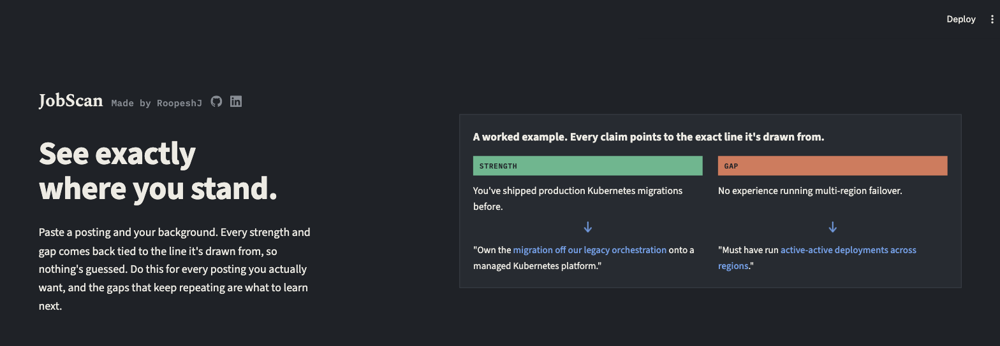
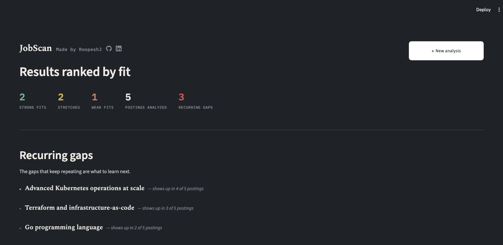
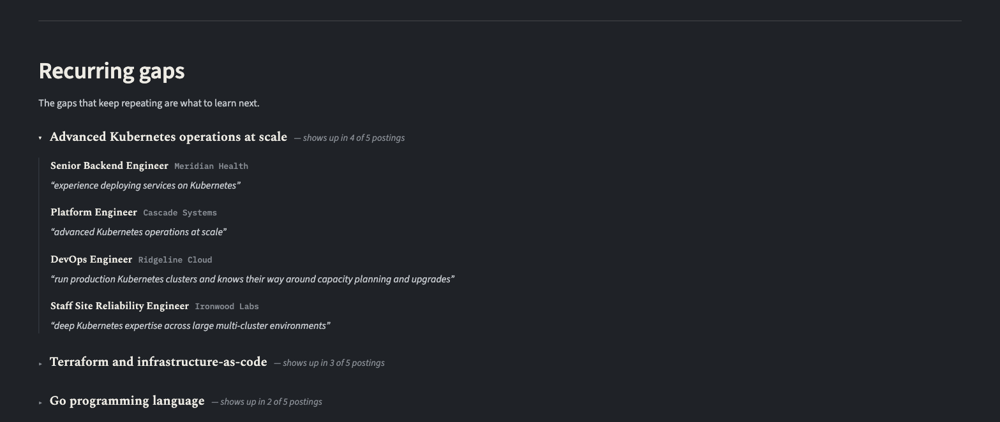
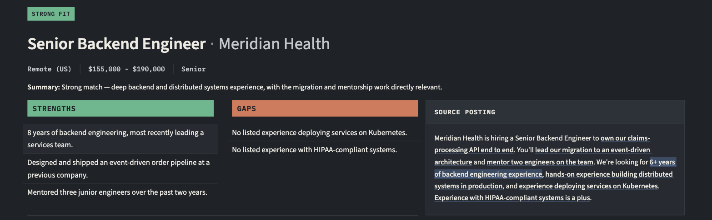

# JobScan

**[Try it live →](https://job-scanner-roopj.streamlit.app/)**



Paste a job posting and your background, and JobScan tells you where you actually stand: what the posting requires versus what's just preferred, and your real strengths and gaps against it. Every claim is tied back to the exact line in the posting it came from, so there's nothing to take on faith.

If you'd rather not paste your own resume in, there's a "See a sample analysis" button on the input page. It loads instantly and doesn't cost anything to run.

## Recurring gaps



This is the feature that's actually hard to get out of a chat window. Paste in five postings at once and JobScan looks across all of them for gaps that keep showing up, not just what's wrong with each one individually. A chat only ever sees one job posting at a time, so it can't tell you that the Kubernetes gap you keep hitting is the thing actually worth fixing before your next ten applications.

Click a gap and it expands to show what every affected posting specifically asked for, in that posting's own words, so you can check the pattern is real instead of taking the tool's word for it.



## Traceable citations



Open any posting and its strengths and gaps sit right next to the text they were pulled from, with the exact lines underlined. If something can't be traced back to real text in the posting, it gets dropped rather than shown, and you'll see a note saying so.

## How it works

1. **Extraction.** The posting gets broken down into structured facts: title, company, seniority, responsibilities, requirements. Each requirement is tagged required, preferred, or unclear and backed by a verbatim quote.
2. **Analysis.** Your background gets compared against that structure to produce strengths and gaps, each one citing the specific requirement or responsibility it came from.
3. **Batch mode.** Analyze up to 5 postings at once, ranked by fit.
4. **Recurring gaps.** Across that batch, whatever gap keeps showing up gets pulled out and shown first.

## Using it

The live demo is the quickest way to try this. Nothing to install. It's a single shared deployment though, so there's a daily cap on postings analyzed, split across everyone using the link.

To run it yourself, with no shared cap and full access to the code:

```bash
git clone https://github.com/Roopesh-J/Job-Scanner.git
cd Job-Scanner
python -m venv venv
source venv/bin/activate
pip install -e ".[dev]"

export ANTHROPIC_API_KEY=your-key-here
streamlit run job_scanner/app.py
```

You'll need your own [Anthropic API key](https://console.anthropic.com/). Usage is billed to that key, not shared with anyone else using the app.

## Evaluation

It's easy to claim an extraction pipeline works. `job_scanner/eval/` actually measures it, against a hand-labeled reference set of 5 postings in `tests/fixtures/eval/`. It checks requirement and responsibility precision and recall, whether required/preferred/unclear gets classified correctly, and grounding rate, which is how often an extracted quote is verifiably real text from the posting. Matching predicted items against the reference set uses local sentence embeddings instead of exact string comparison, so a differently worded but equivalent extraction still counts as correct.

Latest run against the reference set, from 2026-08-21:

| Metric | Score |
|---|---|
| Requirement precision | 1.00 |
| Requirement recall | 1.00 |
| Responsibility precision | 0.95 |
| Responsibility recall | 1.00 |
| Category accuracy | 0.85 |
| Grounding rate | 1.00 |

Category accuracy is the one score that isn't perfect, and the reason is consistent: every miss in this run was the model calling an ambiguous requirement "required" or "preferred" when it should have been "unclear." None went the other way. That's a specific failure mode worth knowing about, not just noise in the numbers.

Run it yourself with a real `ANTHROPIC_API_KEY` set. This makes real, billed API calls:

```bash
python -m job_scanner.eval.run_eval
```

`matching.py` and `metrics.py` have their own fast, free tests (`pytest tests/test_eval_matching.py tests/test_eval_metrics.py`) that run the local embedding model against synthetic examples, no API calls needed. `run_eval.py` itself is intentionally left out of the `pytest` suite since it spends real money.

## Deploying your own copy

1. Fork this repo. On [share.streamlit.io](https://share.streamlit.io), connect your fork and point the main file path at `job_scanner/app.py`.
2. Add `ANTHROPIC_API_KEY` to the app's Secrets panel.
3. Deploy. `requirements.txt` installs everything from `pyproject.toml`.

A deployed copy has no login by design, so anyone with the URL can use it. There's a shared, in-memory daily cap on postings analyzed to keep API spend bounded, plus per-batch and per-field character limits. A redeploy or a Streamlit Cloud cold start resets the daily counter, so treat it as a best-effort budget rather than a hard guarantee. The character limits are enforced client-side only, so they stop accidental large pastes but not someone deliberately working around the widget.

## Tech stack

Python, the Anthropic API directly (no agent framework), Pydantic, Streamlit. Tests run with `pytest`.
